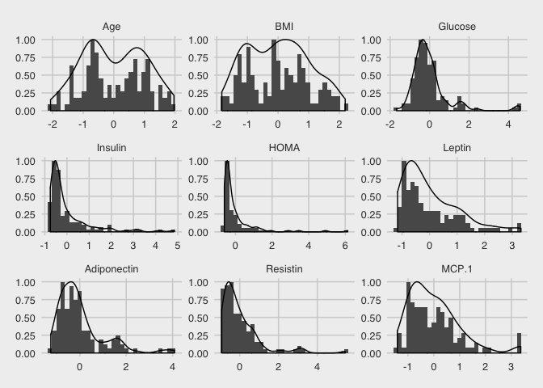
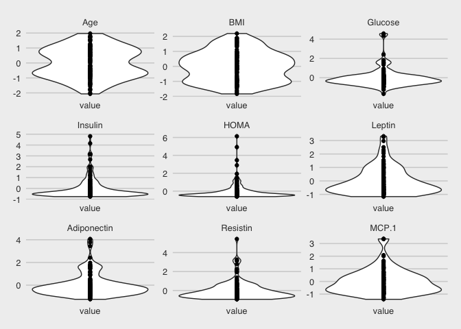
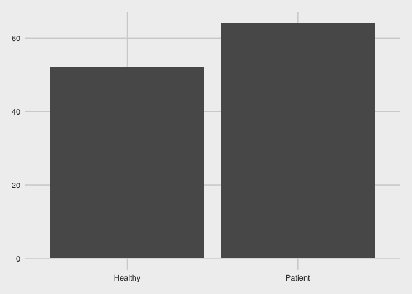
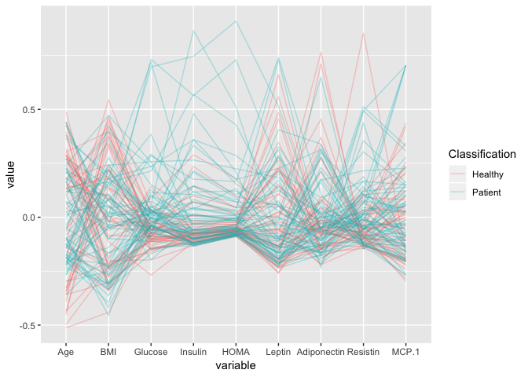
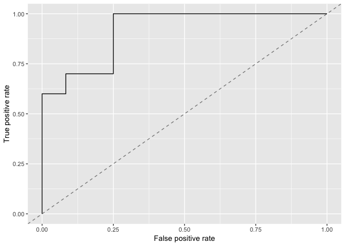

SVM
================
Murat Koptur
01 Eylül 2018

#### Import required libs.

``` r
library(caret)
library(dplyr)
library(GGally)
library(ggplot2)
library(ggthemes)
library(mlr)
library(reshape2)
```

#### Read data file.

``` r
data <- read.csv(file = "../data/Breast_Cancer_Coimbra_DataSet.csv")
str(data)
```

    ## 'data.frame':    116 obs. of  10 variables:
    ##  $ Age           : int  48 83 82 68 86 49 89 76 73 75 ...
    ##  $ BMI           : num  23.5 20.7 23.1 21.4 21.1 ...
    ##  $ Glucose       : int  70 92 91 77 92 92 77 118 97 83 ...
    ##  $ Insulin       : num  2.71 3.12 4.5 3.23 3.55 ...
    ##  $ HOMA          : num  0.467 0.707 1.01 0.613 0.805 ...
    ##  $ Leptin        : num  8.81 8.84 17.94 9.88 6.7 ...
    ##  $ Adiponectin   : num  9.7 5.43 22.43 7.17 4.82 ...
    ##  $ Resistin      : num  8 4.06 9.28 12.77 10.58 ...
    ##  $ MCP.1         : num  417 469 555 928 774 ...
    ##  $ Classification: int  1 1 1 1 1 1 1 1 1 1 ...

#### Convert `Classification` column from `int` to `factor`. 

``` r
data$Classification <- factor(
  data$Classification,
  levels = c(1, 2),
  labels = c("Healthy", "Patient")
)
str(data)
```

    ## 'data.frame':    116 obs. of  10 variables:
    ##  $ Age           : int  48 83 82 68 86 49 89 76 73 75 ...
    ##  $ BMI           : num  23.5 20.7 23.1 21.4 21.1 ...
    ##  $ Glucose       : int  70 92 91 77 92 92 77 118 97 83 ...
    ##  $ Insulin       : num  2.71 3.12 4.5 3.23 3.55 ...
    ##  $ HOMA          : num  0.467 0.707 1.01 0.613 0.805 ...
    ##  $ Leptin        : num  8.81 8.84 17.94 9.88 6.7 ...
    ##  $ Adiponectin   : num  9.7 5.43 22.43 7.17 4.82 ...
    ##  $ Resistin      : num  8 4.06 9.28 12.77 10.58 ...
    ##  $ MCP.1         : num  417 469 555 928 774 ...
    ##  $ Classification: Factor w/ 2 levels "Healthy","Patient": 1 1 1 1 1 1 1 1 1 1 ...

#### Variables has different scales. Rescale them.

``` r
data_scaled <- mutate_if(data, is.numeric, scale)
head(data_scaled)
```

    ##          Age        BMI    Glucose    Insulin       HOMA     Leptin
    ## 1 -0.5772891 -0.8131475 -1.2338692 -0.7255915 -0.6116289 -0.9283067
    ## 2  1.5949016 -1.3727948 -0.2571837 -0.6850661 -0.5458722 -0.9263936
    ## 3  1.5328390 -0.8879123 -0.3015785 -0.5476970 -0.4627448 -0.4522571
    ## 4  0.6639627 -1.2379325 -0.9231056 -0.6740408 -0.5717293 -0.8722371
    ## 5  1.7810894 -1.2890089 -0.2571837 -0.6419582 -0.5188300 -1.0381783
    ## 6 -0.5152265 -0.9417381 -0.2571837 -0.6740408 -0.5389559 -1.0312817
    ##   Adiponectin   Resistin       MCP.1 Classification
    ## 1 -0.06991818 -0.5431610 -0.33977652        Healthy
    ## 2 -0.69433755 -0.8604811 -0.19039777        Healthy
    ## 3  1.79023159 -0.4397524  0.05796261        Healthy
    ## 4 -0.44003562 -0.1581811  1.13778142        Healthy
    ## 5 -0.78348187 -0.3348991  0.69171506        Healthy
    ## 6  0.51128181 -0.3557818 -0.01224876        Healthy

#### Visual Exploration.

``` r
ggplot(melt(data_scaled), aes(value)) +
  geom_histogram(aes(y = ..ncount..)) +
  geom_density(aes(y = ..scaled..)) +
  facet_wrap( ~ variable, scales = "free") +
  theme_fivethirtyeight()
```



``` r
ggplot(melt(data_scaled), aes("value", value)) +
  geom_violin() +
  geom_point() + facet_wrap(~ variable, scales = "free") +
  theme_fivethirtyeight()
```



``` r
ggplot(data_scaled, aes(Classification)) + geom_bar() +
  theme_fivethirtyeight()
```



``` r
ggparcoord(
  data_scaled,
  columns = 1:9,
  alpha = .30,
  scale = "center",
  groupColumn = "Classification"
)
```



#### Training and testing phase.

``` r
indTraining <-
  createDataPartition(data_scaled$Classification, p = .8, list = FALSE)
data_scaled_train <- data_scaled[indTraining, ]
data_scaled_test <- data_scaled[-indTraining, ]
```

``` r
train_task = makeClassifTask(id = "Breast Cancer Coimbra training",
                             data = data_scaled_train,
                             target = "Classification")
test_task = makeClassifTask(id = "Breast Cancer Coimbra test",
                            data = data_scaled_test,
                            target = "Classification")
print(train_task)
```

    ## Supervised task: Breast Cancer Coimbra training
    ## Type: classif
    ## Target: Classification
    ## Observations: 94
    ## Features:
    ##    numerics     factors     ordered functionals 
    ##           0           0           0           9 
    ## Missings: FALSE
    ## Has weights: FALSE
    ## Has blocking: FALSE
    ## Has coordinates: FALSE
    ## Classes: 2
    ## Healthy Patient 
    ##      42      52 
    ## Positive class: Healthy

``` r
print(test_task)
```

    ## Supervised task: Breast Cancer Coimbra test
    ## Type: classif
    ## Target: Classification
    ## Observations: 22
    ## Features:
    ##    numerics     factors     ordered functionals 
    ##           0           0           0           9 
    ## Missings: FALSE
    ## Has weights: FALSE
    ## Has blocking: FALSE
    ## Has coordinates: FALSE
    ## Classes: 2
    ## Healthy Patient 
    ##      10      12 
    ## Positive class: Healthy

#### Firstly, I'll train 4 different models and, I'll choose one of them and fine-tune it.

``` r
# svm
svm <-
  makeLearner("classif.ksvm", id = "svm", predict.type = "prob")
# xgboost
xgb <-
  makeLearner("classif.xgboost", id = "xgb", predict.type = "prob")
# Penalized Logistic Regression
rrf <-
  makeLearner("classif.rpart", id = "rrf", predict.type = "prob")
# Regularized Random Forests
plr <-
  makeLearner("classif.penalized", id = "plr", predict.type = "prob")
```

``` r
learners <- list(svm, xgb, rrf, plr)

cv <- makeResampleDesc(
  method = "RepCV",
  reps = 10,
  folds = 10,
  stratify = TRUE
)

measures <- list(acc, f1, timetrain)

train_res <-
  benchmark(
    learners = learners,
    tasks = train_task,
    resamplings = cv,
    measures = measures
  )
```

``` r
print(train_res)
```

    ##                          task.id learner.id acc.test.mean f1.test.mean
    ## 1 Breast Cancer Coimbra training        svm     0.7211515    0.6636667
    ## 2 Breast Cancer Coimbra training        xgb     0.6616667    0.6045271
    ## 3 Breast Cancer Coimbra training        rrf     0.6487778    0.5943691
    ## 4 Breast Cancer Coimbra training        plr     0.7085556    0.6701068
    ##   timetrain.test.mean
    ## 1             0.02230
    ## 2             0.00239
    ## 3             0.00400
    ## 4             0.00718

#### Fine-tuning.

``` r
getLearnerParamSet(svm)
```

    ##                        Type  len    Def
    ## scaled              logical    -   TRUE
    ## type               discrete    -  C-svc
    ## kernel             discrete    - rbfdot
    ## C                   numeric    -      1
    ## nu                  numeric    -    0.2
    ## epsilon             numeric    -    0.1
    ## sigma               numeric    -      -
    ## degree              integer    -      3
    ## scale               numeric    -      1
    ## offset              numeric    -      1
    ## order               integer    -      1
    ## tol                 numeric    -  0.001
    ## shrinking           logical    -   TRUE
    ## class.weights numericvector <NA>      -
    ## fit                 logical    -   TRUE
    ## cache               integer    -     40
    ##                                                 Constr Req Tunable Trafo
    ## scaled                                               -   -    TRUE     -
    ## type              C-svc,nu-svc,C-bsvc,spoc-svc,kbb-svc   -    TRUE     -
    ## kernel        vanilladot,polydot,rbfdot,tanhdot,lap...   -    TRUE     -
    ## C                                             0 to Inf   Y    TRUE     -
    ## nu                                            0 to Inf   Y    TRUE     -
    ## epsilon                                    -Inf to Inf   Y    TRUE     -
    ## sigma                                         0 to Inf   Y    TRUE     -
    ## degree                                        1 to Inf   Y    TRUE     -
    ## scale                                         0 to Inf   Y    TRUE     -
    ## offset                                     -Inf to Inf   Y    TRUE     -
    ## order                                      -Inf to Inf   Y    TRUE     -
    ## tol                                           0 to Inf   -    TRUE     -
    ## shrinking                                            -   -    TRUE     -
    ## class.weights                                 0 to Inf   -    TRUE     -
    ## fit                                                  -   -   FALSE     -
    ## cache                                         1 to Inf   -    TRUE     -

``` r
par_set = makeParamSet(makeNumericParam("C", lower = -5, upper = 15, trafo = function(x) 2^x),
                       makeNumericParam("sigma", lower = -15, upper = 3, trafo = function(x) 2^x))
ctrl = makeTuneControlRandom(maxit = 20)
res = tuneParams(
  learner = svm,
  task = train_task,
  resampling = cv,
  measures = measures,
  par.set = par_set,
  control = ctrl
)
```

``` r
print(res)
```

    ## Tune result:
    ## Op. pars: C=93.4; sigma=0.0132
    ## acc.test.mean=0.7368788,f1.test.mean=0.6890224,timetrain.test.mean=0.0137500

#### Make a model with our fine-tuned parameters.

``` r
lrn <- setHyperPars(makeLearner("classif.ksvm", predict.type = "prob"), par.vals = res$x)
fit <- train(lrn, train_task)
getLearnerModel(fit)
```

    ## Support Vector Machine object of class "ksvm" 
    ## 
    ## SV type: C-svc  (classification) 
    ##  parameter : cost C = 93.3686410418601 
    ## 
    ## Gaussian Radial Basis kernel function. 
    ##  Hyperparameter : sigma =  0.0131535468272759 
    ## 
    ## Number of Support Vectors : 49 
    ## 
    ## Objective Function Value : -2973.099 
    ## Probability model included.

#### Make prediction.

``` r
preds <- predict(fit, test_task)
```

#### ROC curve.
``` r
roc <-
  generateThreshVsPerfData(preds, measures = list(fpr, tpr))
plotROCCurves(roc)
```


