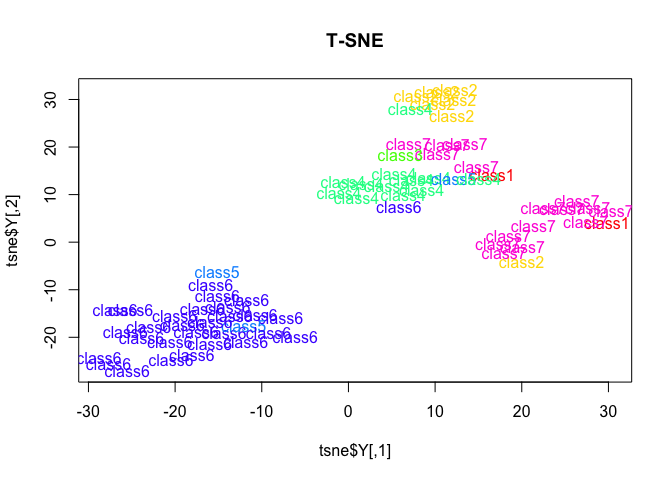
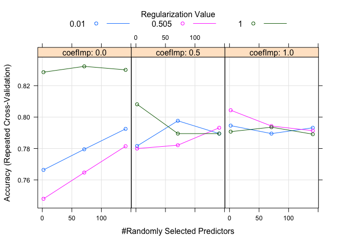
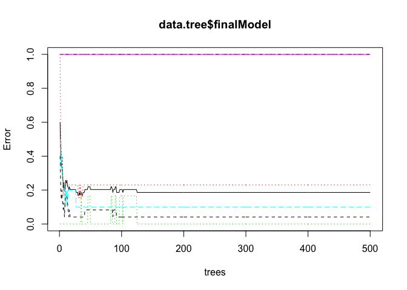

t-SNE & Random Forests
================
Murat Koptur
30 Ağustos 2018

*Dataset source*: http://archive.ics.uci.edu/ml/datasets/SCADI

*Data Set Information*:

This dataset contains 206 attributes of 70 children with physical and motor disability based on ICF-CY. 
In particular, the SCADI dataset is the only one that has been used by ML researchers for self-care problems classification based on ICF-CY to this date. 
The 'Class' field refers to the presence of the self-care problems of the children with physical and motor disabilities.The classes are determined by occupational therapists. 
The names and social security numbers of the children were recently removed from the dataset. 

Two files have been 'processed', SCADI.arff for using in WEKA and SCADI.CSV for using in MATLAB and similar tools. 

*Relevant Papers*:

Zarchi, M. S., SMM Fatemi Bushehri, and M. Dehghanizadeh. 'SCADI: A standard dataset for self-care problems classification of children with physical and motor disability.' International Journal of Medical Informatics (2018). 

``` r
library(caret)
library(dplyr)
library(Rtsne)
```

``` r
data <- read.csv("../data/SCADI.csv")

data <- mutate_at(data, vars(-one_of("Age")), as.factor)
data <- data[,lapply(data, nlevels) >= 2]
```

``` r
summary(data)
```

    ##  Gender d.5100.0 d.5100.1 d.5100.2 d.5100.3 d.5100.4 d.5101.1 d.5101.2
    ##  0:41   0:65     0:60     0:51     0:58     0:46     0:63     0:52    
    ##  1:29   1: 5     1:10     1:19     1:12     1:24     1: 7     1:18    
    ##                                                                       
    ##                                                                       
    ##                                                                       
    ##                                                                       
    ##                                                                       
    ##  d.5101.3 d.5101.4 d.5102.0 d.5102.1 d.5102.2 d.5102.3 d.5102.4 d.5200.0
    ##  0:54     0:41     0:66     0:65     0:53     0:54     0:42     0:66    
    ##  1:16     1:29     1: 4     1: 5     1:17     1:16     1:28     1: 4    
    ##                                                                         
    ##                                                                         
    ##                                                                         
    ##                                                                         
    ##                                                                         
    ##  d.5200.1 d.5200.2 d.5200.3 d.5200.4 d.5201.0 d.5201.1 d.5201.2 d.5201.3
    ##  0:63     0:63     0:39     0:49     0:65     0:57     0:64     0:50    
    ##  1: 7     1: 7     1:31     1:21     1: 5     1:13     1: 6     1:20    
    ##                                                                         
    ##                                                                         
    ##                                                                         
    ##                                                                         
    ##                                                                         
    ##  d.5201.4 d.5202.0 d.5202.1 d.5202.2 d.5202.3 d.5202.4 d.5203.0 d.5203.1
    ##  0:44     0:65     0:58     0:63     0:50     0:44     0:69     0:66    
    ##  1:26     1: 5     1:12     1: 7     1:20     1:26     1: 1     1: 4    
    ##                                                                         
    ##                                                                         
    ##                                                                         
    ##                                                                         
    ##                                                                         
    ##  d.5203.2 d.5203.3 d.5203.4 d.5204.0 d.5204.1 d.5204.2 d.5204.3 d.5204.4
    ##  0:58     0:53     0:34     0:69     0:66     0:58     0:53     0:34    
    ##  1:12     1:17     1:36     1: 1     1: 4     1:12     1:17     1:36    
    ##                                                                         
    ##                                                                         
    ##                                                                         
    ##                                                                         
    ##                                                                         
    ##  d.5205.0 d.5205.1 d.5205.2 d.5205.3 d.5205.4 d.53000.0 d.53000.1
    ##  0:65     0:58     0:62     0:50     0:45     0:45      0:43     
    ##  1: 5     1:12     1: 8     1:20     1:25     1:25      1:27     
    ##                                                                  
    ##                                                                  
    ##                                                                  
    ##                                                                  
    ##                                                                  
    ##  d.53000.2 d.53000.3 d.53000.4 d.53001.0 d.53001.1 d.53001.2 d.53001.3
    ##  0:63      0:69      0:60      0:68      0:61      0:50      0:68     
    ##  1: 7      1: 1      1:10      1: 2      1: 9      1:20      1: 2     
    ##                                                                       
    ##                                                                       
    ##                                                                       
    ##                                                                       
    ##                                                                       
    ##  d.53001.4 d.53010.0 d.53010.1 d.53010.2 d.53010.3 d.53010.4 d.53011.0
    ##  0:33      0:44      0:43      0:64      0:69      0:60      0:69     
    ##  1:37      1:26      1:27      1: 6      1: 1      1:10      1: 1     
    ##                                                                       
    ##                                                                       
    ##                                                                       
    ##                                                                       
    ##                                                                       
    ##  d.53011.1 d.53011.2 d.53011.3 d.53011.4 d.5302.2 d.5302.3 d.5302.4
    ##  0:61      0:49      0:68      0:33      0:67     0:66     0:61    
    ##  1: 9      1:21      1: 2      1:37      1: 3     1: 4     1: 9    
    ##                                                                    
    ##                                                                    
    ##                                                                    
    ##                                                                    
    ##                                                                    
    ##  d.5302.9 d.5400.0 d.5400.1 d.5400.2 d.5400.3 d.5400.4 d.5401.0 d.5401.1
    ##  0:16     0:64     0:65     0:54     0:57     0:40     0:64     0:64    
    ##  1:54     1: 6     1: 5     1:16     1:13     1:30     1: 6     1: 6    
    ##                                                                         
    ##                                                                         
    ##                                                                         
    ##                                                                         
    ##                                                                         
    ##  d.5401.2 d.5401.3 d.5401.4 d.5402.0 d.5402.1 d.5402.2 d.5402.3 d.5402.4
    ##  0:55     0:55     0:42     0:64     0:65     0:54     0:57     0:40    
    ##  1:15     1:15     1:28     1: 6     1: 5     1:16     1:13     1:30    
    ##                                                                         
    ##                                                                         
    ##                                                                         
    ##                                                                         
    ##                                                                         
    ##  d.5403.0 d.5403.1 d.5403.2 d.5403.3 d.5403.4 d.5404.0 d.5404.1 d.5404.2
    ##  0:63     0:62     0:47     0:66     0:42     0:53     0:29     0:66    
    ##  1: 7     1: 8     1:23     1: 4     1:28     1:17     1:41     1: 4    
    ##                                                                         
    ##                                                                         
    ##                                                                         
    ##                                                                         
    ##                                                                         
    ##  d.5404.4 d.5500.0 d.5500.1 d.5500.2 d.5500.4 d.5501.0 d.5501.1 d.5501.2
    ##  0:62     0:18     0:56     0:68     0:68     0:61     0:58     0:62    
    ##  1: 8     1:52     1:14     1: 2     1: 2     1: 9     1:12     1: 8    
    ##                                                                         
    ##                                                                         
    ##                                                                         
    ##                                                                         
    ##                                                                         
    ##  d.5501.3 d.5501.4 d.5600.0 d.5600.1 d.5600.2 d.5600.4 d.5602.0 d.5602.1
    ##  0:53     0:46     0:17     0:57     0:68     0:68     0:59     0:59    
    ##  1:17     1:24     1:53     1:13     1: 2     1: 2     1:11     1:11    
    ##                                                                         
    ##                                                                         
    ##                                                                         
    ##                                                                         
    ##                                                                         
    ##  d.5602.2 d.5602.3 d.5602.4 d.5700.0 d.5700.1 d.5700.2 d.5700.3 d.5700.4
    ##  0:54     0:61     0:47     0:66     0:49     0:56     0:48     0:61    
    ##  1:16     1: 9     1:23     1: 4     1:21     1:14     1:22     1: 9    
    ##                                                                         
    ##                                                                         
    ##                                                                         
    ##                                                                         
    ##                                                                         
    ##  d.5701.0 d.5701.1 d.5701.2 d.5701.3 d.5701.4 d.57020.0 d.57020.1
    ##  0:64     0:47     0:54     0:52     0:63     0:64      0:37     
    ##  1: 6     1:23     1:16     1:18     1: 7     1: 6      1:33     
    ##                                                                  
    ##                                                                  
    ##                                                                  
    ##                                                                  
    ##                                                                  
    ##  d.57020.2 d.57020.3 d.57020.4 d.57021.0 d.57021.1 d.57021.2 d.57021.3
    ##  0:54      0:58      0:67      0:58      0:39      0:53      0:64     
    ##  1:16      1:12      1: 3      1:12      1:31      1:17      1: 6     
    ##                                                                       
    ##                                                                       
    ##                                                                       
    ##                                                                       
    ##                                                                       
    ##  d.57021.4 d.57022.0 d.57022.1 d.57022.2 d.57022.3 d.57022.4 d.571.0
    ##  0:66      0:17      0:56      0:69      0:69      0:69      0:62   
    ##  1: 4      1:53      1:14      1: 1      1: 1      1: 1      1: 8   
    ##                                                                     
    ##                                                                     
    ##                                                                     
    ##                                                                     
    ##                                                                     
    ##  d.571.1 d.571.2 d.571.3 d.571.4   Classes  
    ##  0:47    0:48    0:59    0:64    class1: 2  
    ##  1:23    1:22    1:11    1: 6    class2: 7  
    ##                                  class3: 1  
    ##                                  class4:12  
    ##                                  class5: 3  
    ##                                  class6:29  
    ##                                  class7:16

``` r
colors = rainbow(length(unique(data$Classes)))
names(colors) = unique(data$Classes)
```

``` r
tsne <- Rtsne(data[,-1], dims = 2, perplexity=15, verbose=TRUE, max_iter = 500)
```

    ## Read the 70 x 50 data matrix successfully!
    ## Using no_dims = 2, perplexity = 15.000000, and theta = 0.500000
    ## Computing input similarities...
    ## Normalizing input...
    ## Building tree...
    ##  - point 0 of 70
    ## Done in 0.00 seconds (sparsity = 0.739184)!
    ## Learning embedding...
    ## Iteration 50: error is 53.230326 (50 iterations in 0.02 seconds)
    ## Iteration 100: error is 55.311200 (50 iterations in 0.02 seconds)
    ## Iteration 150: error is 55.275234 (50 iterations in 0.02 seconds)
    ## Iteration 200: error is 52.501895 (50 iterations in 0.02 seconds)
    ## Iteration 250: error is 55.992780 (50 iterations in 0.02 seconds)
    ## Iteration 300: error is 1.847880 (50 iterations in 0.02 seconds)
    ## Iteration 350: error is 1.051075 (50 iterations in 0.01 seconds)
    ## Iteration 400: error is 0.564695 (50 iterations in 0.01 seconds)
    ## Iteration 450: error is 0.288761 (50 iterations in 0.02 seconds)
    ## Iteration 500: error is 0.258384 (50 iterations in 0.01 seconds)
    ## Fitting performed in 0.17 seconds.

``` r
plot(tsne$Y, t='n', main="T-SNE")
text(tsne$Y, labels=data$Classes, col=colors[data$Classes])
```



``` r
indTraining <- createDataPartition(data$Classes, p = .8, list = FALSE)
```

    ## Warning in createDataPartition(data$Classes, p = 0.8, list = FALSE): Some
    ## classes have a single record ( class3 ) and these will be selected for the
    ## sample

``` r
training <- data[indTraining,]
test <- data[-indTraining,]
```

``` r
train_control <- trainControl(
  method = "repeatedcv",
  number = 10,
  repeats = 10,
  verboseIter = TRUE,
  allowParallel = TRUE
)
```

``` r
data.tree <- train(Classes ~ .,
                   data = training,
                   method = "RRF",
                   trControl = train_control)
```

``` r
plot(data.tree)
```



``` r
plot(data.tree$finalModel)
```



``` r
pred_vals <- predict(data.tree, test)
true_vals <- test$Classes
confusionMatrix(pred_vals, true_vals)
```

    ## Confusion Matrix and Statistics
    ## 
    ##           Reference
    ## Prediction class1 class2 class3 class4 class5 class6 class7
    ##     class1      0      0      0      0      0      0      0
    ##     class2      0      1      0      1      0      0      0
    ##     class3      0      0      0      0      0      0      0
    ##     class4      0      0      0      1      0      0      0
    ##     class5      0      0      0      0      0      0      0
    ##     class6      0      0      0      0      0      5      0
    ##     class7      0      0      0      0      0      0      3
    ## 
    ## Overall Statistics
    ##                                           
    ##                Accuracy : 0.9091          
    ##                  95% CI : (0.5872, 0.9977)
    ##     No Information Rate : 0.4545          
    ##     P-Value [Acc > NIR] : 0.00243         
    ##                                           
    ##                   Kappa : 0.8675          
    ##  Mcnemar's Test P-Value : NA              
    ## 
    ## Statistics by Class:
    ## 
    ##                      Class: class1 Class: class2 Class: class3
    ## Sensitivity                     NA       1.00000            NA
    ## Specificity                      1       0.90000             1
    ## Pos Pred Value                  NA       0.50000            NA
    ## Neg Pred Value                  NA       1.00000            NA
    ## Prevalence                       0       0.09091             0
    ## Detection Rate                   0       0.09091             0
    ## Detection Prevalence             0       0.18182             0
    ## Balanced Accuracy               NA       0.95000            NA
    ##                      Class: class4 Class: class5 Class: class6
    ## Sensitivity                0.50000            NA        1.0000
    ## Specificity                1.00000             1        1.0000
    ## Pos Pred Value             1.00000            NA        1.0000
    ## Neg Pred Value             0.90000            NA        1.0000
    ## Prevalence                 0.18182             0        0.4545
    ## Detection Rate             0.09091             0        0.4545
    ## Detection Prevalence       0.09091             0        0.4545
    ## Balanced Accuracy          0.75000            NA        1.0000
    ##                      Class: class7
    ## Sensitivity                 1.0000
    ## Specificity                 1.0000
    ## Pos Pred Value              1.0000
    ## Neg Pred Value              1.0000
    ## Prevalence                  0.2727
    ## Detection Rate              0.2727
    ## Detection Prevalence        0.2727
    ## Balanced Accuracy           1.0000
